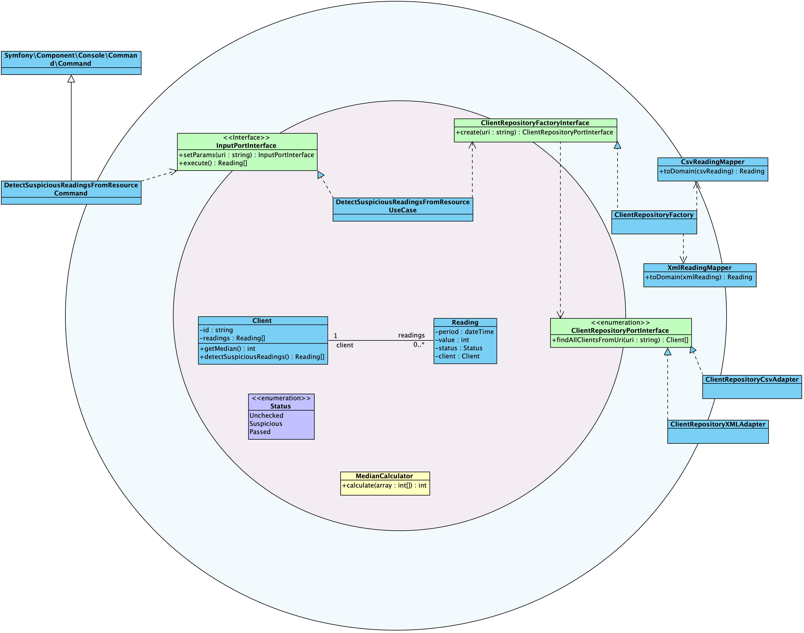

# Suspicious Reading Detector

This code is the WIP technical assessment solution for a backend position at Acme Electric Inc. This code is no longer maintained 
or completed due to a lack of time. This README tries to explain the work that has been done. <ins>This implementation is 
not functional</ins> for the following pending issues TO-DO:

- Issue with de dependency injection (PHP-DI). Not fully configured, it needs more time to investigate.
- Infrastructure layer in TO-DO state. This will implement the adapters of the ClientRepositoryInterface, one of them will implement the access and parse of csv files, and another of xml files.

## Run or test something

This will give you a shell inside the container:
```
docker compose up -d --build
```
Execute the tests inside the running container:

```
docker compose exec srd vendor/bin/phpunit
```

## Assessment Requirements

The literal instructions about the assessment are included in the last section of this README. This is a list with the 
details of the main requirements:

1. CLI application
2. Hexagonal Architecture
3. Automated tests
4. Git
5. Docker
6. Languages: **PHP**, Python or Java

## Language

I have chosen PHP, using some symfony components.

## Architecture (Hexagonal)

Although I wouldn't choose that architecture for an application of this nature I had implemented it as Hexagonal due 
to the requirements.
There are the following layers:

- domain
- application



The idea was to implement the logic in the domain layer. The Client Entity/Model has the method detectSuspiciousReadings 
which detects the suspicious readings in himself. There are several port Interfaces to "interact" with the domain layer:

1. *InputPortInterface* to setParams and launch the execution of the use case.
2. *OutputPortInterface* to obtain the result of the execution.
3. *ClientRepositoryInterface* to obtain data from the infrastructure layer

For the application layer the idea was to use the symfony/console component which implements the OuputPort and it has 
injected the inputPortInterface.

## About Docker

This project uses a two stages Dockerfile, although it is not refined at all.

## About Git

Normally I use Gitflow as strategy, Conventional commit messages and atomic commits. You can check another projects in 
my public GitHub profiles if you are looking for examples. Due to the lack of time this is going to be committed as an 
only commit.

## About tests

This project has implemented the following Unit Tests

```
Client (GonzaloRodriguez\SuspiciousReadingDetector\Tests\Client)
 ✔ Client with one suspicious lower reading
 ✔ Client without suspicious readings
 ✔ Client with two suspicious readings higher and lower

Detect Suspicious Readings From Resource Use Case
 ✔ Detect suspicious readings in two clients

Median Calculator (GonzaloRodriguez\SuspiciousReadingDetector\Tests\MedianCalculator)
 ✔ Calculate median for array with odd elements number
 ✔ Calculate median for array with even elements number

```


## Instructions

```
At Acme Electric Inc. we are worried about fraud in electricity readings and we have decided to implement a suspicious reading detector. 

Some clients have phoned us suspecting some squatters have been tapping into their electricity lines and this is why you may find some extremely high readings compared to their regular usage.
At the same time, we suspect some clients are tapping their building electricity lines and you may also find extremely low readings.

As we all know, many systems in Spain are a bit old fashioned and get some readings in XML and some others in CSV, so we need to be able to implement adaptors for both inputs.

For this first iteration, we will try to identify readings that are either higher or lower than the annual median ± 50%.

Please write a command line application that takes a file name as an argument (such as 2016-readings.xml or 2016-readings.csv) and outputs a table with the suspicious readings:

| Client              | Month              | Suspicious         | Median
 -------------------------------------------------------------------------------
| <clientid>          | <month>            | <reading>          | <median>

You can assume there are no tricks in the XML and CSV files. Each client will have 12 readings and you get all 12 consecutively. Please don't spend time trying to validate all this although it happens in real life sometimes!

In this exercise, we are looking for things like:

   - Hexagonal architecture to handle different inputs (CSV and XML in this case, but it could be a database or even a txt file in a remote FTP! True story...)

 Bonus points if you use:
   - Idiomatic features of the language
   - Automated tests
   - Git
   - Docker or similar

The solution can be written in any of our stack languages: PHP, Python or Java.

You can use any external library or language version :)
```